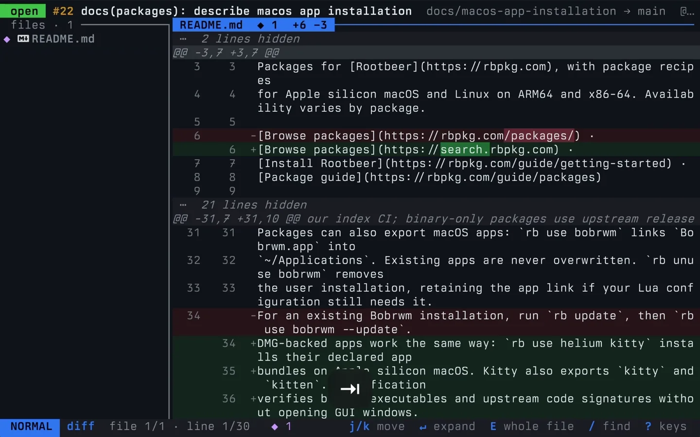

# prtui

Review pull requests and local changes from your terminal, with Vim motions and
a command line.

[Documentation](https://prtui.tale.me) · [Releases](https://github.com/tale/prtui/releases)

[](docs/overview.mp4)

## Contributing

```sh
cargo fmt --all
cargo clippy --all-targets --all-features -- -D warnings
cargo test --all-features
```

`mise run check` runs all three. A change users would notice needs a changeset
in `.changeset/` (`mise exec -- knope document-change`).

For the docs, run `pnpm install` and `pnpm docs:dev`. Check the production build
with `pnpm docs:build`.

`pnpm fmt` formats supported files; `pnpm check` checks formatting and lints the
docs code. Run `mise install` to install Lefthook and activate the pre-commit
checks.

## License

MIT. See `LICENSE`.
